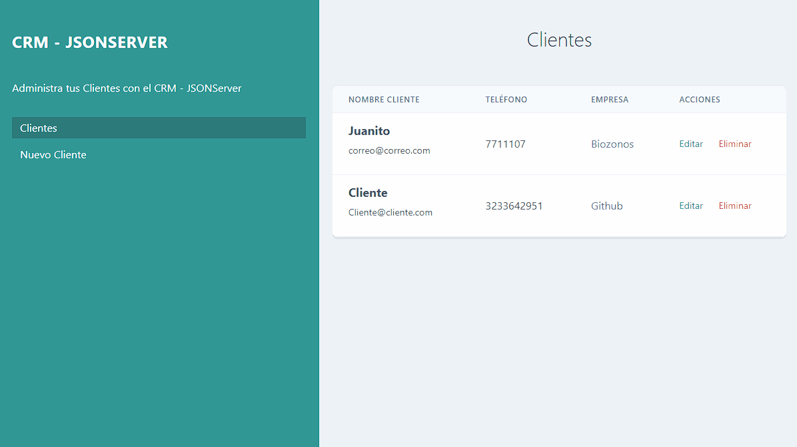

<h1 align="center">🌟 PROJECT: CRM CRUD REST API
🎨</h1>

<h3 align="center">📊 Project made with javascript, html, css, json server and tailwindcss </h3>

  

<h3>📄 Description:</h3>

> 📝 This project is a MERN project that allows you to manage a list of clients, you can add, edit and delete clients.

<h3>🚀 Deploy link: </h3>

> 🌎 No deploy yet.

<h3>📄 Preview: </h3>

<h3>📄 Technologies used and resources used :</h3>

 
      
       
      
      

 

-   [JAVASCRIPT](https://developer.mozilla.org/es/docs/Web/JavaScript 'JAVASCRIPT')
-   [CSS3](https://developer.mozilla.org/es/docs/Web/CSS 'CSS3')
-   [HTML5](https://developer.mozilla.org/es/docs/Web/HTML 'HTML5')
-   [TAILWINDCSS](https://tailwindcss.com/ 'TAILWINDCSS')

<h3>🤖 Aviable Commands: </h3>

      - no commands yet.

<h3>⚙️ How to start: </h3>

-   Clone the repository in your computer.
-   Navigate to the root folder of the project.
-   open index.html in your browser.
-   Enjoy it. 🎉

<h3>🤝 How to contribute: </h3>

If you would like to contribute to this project, we would love to receive your contributions! You can help in the following ways:

-   Correcting errors in the code.
-   Adding new features to the project.
-   Improving existing documentation.
-   Sharing your ideas and suggestions in the "Issues" section of the project.
-   Thank you for your interest in this project! 🎉

<h3>🤝 Developed by: </h3>

> 🌎 [Racknar0](https://github.com/Racknar0 'Deployment Link')

